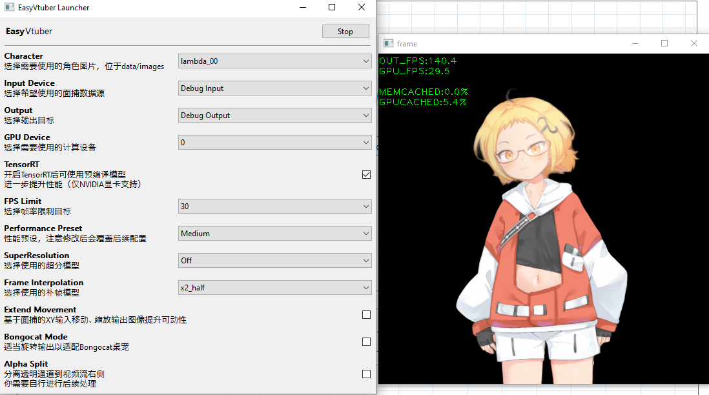

# EasyVtuber  

> 用买皮的钱，再买一张~~3080~~随便哪张显卡吧！


Fork自 https://github.com/GunwooHan/EasyVtuber  
为解决面捕质量问题，又反向port了原版demo https://github.com/pkhungurn/talking-head-anime-2-demo 中关于ifacialmocap的ios面捕逻辑  
并且省略了ifacialmocap pc端，通过UDP直连的方式使ios面捕刷新率达到最高60fps，解决了面捕刷新率的瓶颈  
最后，给EasyVtuber中使用的OBS虚拟摄像头方案增加配套的Shader支持，解锁RGBA输出能力，无需绿背即可直接使用

[视频介绍和安装说明](https://www.bilibili.com/video/BV1rJwgeoE2j)  

Updates:  
* 使用 https://github.com/zpeng11/ezvtuber-rt/tree/main 项目转换的ONNX模型，实现TensorRT加速以及非N卡支持，在半精度和全精度下均有加速（具体取决于显卡）  
* 为A卡和I卡提供DirectML支持，人人都能玩。  
* 引入[RIFE](https://github.com/hzwer/ECCV2022-RIFE)模型进行插帧，极限帧数提升达到50%-100%，配合锁帧可以有效降低使用占用。  
* 使用 [TurboJPEG](https://github.com/Dobatymo/turbojpeg-python) 获得成倍缓存命中率提升，在长时间使用上显卡减负效果相当出色。  
* 使用 [waifu2x](https://github.com/nagadomi/waifu2x) 和 [real-esrgan](https://github.com/xinntao/Real-ESRGAN) 项目带来的输出超分辨率，对比anime4k效果提升显著（也使用更多gpu占用）  
* 更漂亮的 WxPython 新启动器界面，带中文介绍更加简单易用  
* 添加Spout2 支持输出原生透明通道给OBS

## Requirements  

### 硬件  

- 支持FaceID的iPhone（使用ifacialmocap软件，需购买，需要稳定的WIFI连接）或网络摄像头（使用OpenCV）  
- 任意5年内的游戏级显卡，N卡/A卡/I卡均可使用，某些性能强的核显也可尝试，请参考[性能测试结果](PerformanceTest.md)
### 软件

- 本方案在Windows 10上测试可用
- OBS或Unity Capture（虚拟摄像头方案）
- Photoshop或其他图片处理软件
- 科学上网方案，看懂英文网站和报错的能力

## 整合包版本
请使用合适方式下载整合包并自行解压：
* [夸克网盘](https://pan.quark.cn/s/cda200521df7)  
* 磁力链接 magnet:?xt=urn:btih:89bee6bc129f2e146f799e6421c0d5ef3bb4b9ff
* [谷歌网盘](https://drive.google.com/drive/folders/1cYj18EfVQ2Cl348_rkCu_fgaasHTI_io?usp=drive_link)  

### 安装Spout2 OBS插件(可选)
安装整合包附带的 `OBS_Spout2_Plugin_Install_v1.8.exe`， 安装包来自 https://github.com/Off-World-Live/obs-spout2-plugin 项目，可以提供透明通道给OBS。

### 构建TensorRT模型（N卡专用，可选）  
双击`02.构建TensorRT模型（N卡使用）.bat`，若是英伟达用户将会开始TensorRT构建, 每台配置仅需构建一次，更新显卡驱动可能需要重新构建  
额外需要>20min时间(取决于显卡)，结束后可以大幅提升运行速度（可简单理解为玩游戏之前编译着色器，和每个人显卡有关）  
构建的开头和结束输出如下，请耐心等进度条百分百或完成后自动退出。  
若不慎关掉窗口也可以双击自动从断点重来，可以先放后台运行构建并尝试下一步运行暂时不勾选TensorRT：  
```
Start testing if TensorRT works on this machine
  0%|                                                                                           | 0/38 [00:00<?, ?it/s][01/09/2025-22:36:52] [TRT] [I] [MemUsageChange] Init CUDA: CPU +89, GPU +0, now: CPU 6758, GPU 1009 (MiB)
[01/09/2025-22:36:57] [TRT] [I] [MemUsageChange] Init builder kernel library: CPU +1358, GPU +194, now: CPU 8423, GPU 1203 (MiB)
[01/09/2025-22:36:57] [TRT] [I] Loading ONNX file from path ./data/models\rife_512\x2\fp32.onnx...
[01/09/2025-22:36:57] [TRT] [I] Beginning ONNX file parsing
[01/09/2025-22:36:57] [TRT] [I] Completed parsing of ONNX file
[01/09/2025-22:36:57] [TRT] [I] Input number: 2
[01/09/2025-22:36:57] [TRT] [I] Output number: 2
[01/09/2025-22:36:57] [TRT] [I] Building an engine from file ./data/models\rife_512\x2\fp32.onnx; this may take a while...
....
....
....
[01/10/2025-21:16:53] [TRT] [I] [BlockAssignment] Started assigning block shifts. This will take 66 steps to complete.
[01/10/2025-21:16:53] [TRT] [I] [BlockAssignment] Algorithm ShiftNTopDown took 3.4012ms to assign 7 blocks to 66 nodes requiring 218136064 bytes.
[01/10/2025-21:16:53] [TRT] [I] Total Activation Memory: 218135552 bytes
[01/10/2025-21:16:53] [TRT] [I] Total Weights Memory: 2724242 bytes
[01/10/2025-21:16:53] [TRT] [I] Compiler backend is used during engine execution.
[01/10/2025-21:16:53] [TRT] [I] Engine generation completed in 160.706 seconds.
[01/10/2025-21:16:53] [TRT] [I] [MemUsageStats] Peak memory usage of TRT CPU/GPU memory allocators: CPU 89 MiB, GPU 317 MiB
[01/10/2025-21:16:53] [TRT] [I] Completed creating Engine
[01/10/2025-21:16:53] [TRT] [I] Saving engine to file ./data/models\waifu2x_upconv\fp16\upconv_7\art\scale2x.trt
[01/10/2025-21:16:53] [TRT] [I] Completed saving engine
100%|██████████████████████████████████████████████████████████████████████████████████| 38/38 [46:54<00:00, 74.07s/it]
```

### 启动项目
双击`02A.启动器.bat` 或 `02B.启动器（调试输出）.bat` 启动器，如下图启动。如果上一步构建未完成或者使用A/I卡，需要**手动**将TensorRT去除勾选：
   
之后请移步后文的输入输出&性能配置板块自行调节。如有问题请先参考本页末的FAQ再提出。

## Installation(科学上网且使用Git)  
可使用此安装方法对本项目二次开发

### 安装Anaconda（可选）
前往https://www.anaconda.com/ 安装Anaconda 并保证加入环境变量命令行可以找到，如：
```
C:\Users\Eleven>conda --version
conda 24.11.3
```
以上方式可以保证conda环境被你选定的Ananconda统一管理。若没有此需求可以忽略直接运行下一步，`01X.构建运行环境（XX源）.bat`脚本会自动安装miniconda。

### 克隆项目和子项目
```
git clone https://github.com/zpeng11/EasyVtuber.git
cd EasyVtuber
git submodule init
git submodule update --recursive --remote
```

### 安装环境
根据网络环境双击运行`01A.构建运行环境（默认源）.bat`或者`01B.构建运行环境（国内源）.bat`   
这两个脚本会构建名为`ezvtb_rt_venv`的conda环境  
或可以用如下命令手动创建：   
```
conda create -y -n ezvtb_rt_venv python=3.10
conda activate ezvtb_rt_venv
conda install -y nvidia/label/cuda-12.6.3::cuda-nvcc-dev_win-64
conda install -y conda-forge::pycuda
python -m pip install --upgrade pip wheel
python -m pip install nvidia-cudnn-cu12
pip install tensorrt_cu12_libs==10.6.0 tensorrt_cu12_bindings==10.6.0 tensorrt==10.6.0 --extra-index-url https://pypi.nvidia.com
python -m pip install -r requirements.txt --no-warn-script-location
```

### 下载模型
前往模型 release 地址 https://github.com/zpeng11/ezvtuber-rt/releases/tag/0.0.1   
下载 https://github.com/zpeng11/ezvtuber-rt/releases/download/0.0.1/20241220.zip 并解压到`data/models`文件夹下

### Pycharm 配置
安装完成后，在Pycharm内打开本项目，右下角解释器菜单点开，`Add Interpreter...`->`Conda Environment`->`Existing environment`  
选好自己电脑上的`conda.exe`和刚才创建好的`ezvtb_rt_venv`环境内的`python.exe`    
点击OK，依赖全亮即可  

### 检查环境模型，并构建TensorRT  
在Conda环境中执行以下命令  
`python ezvtb_rt_interface.py`  

### 运行启动器  
在Conda环境中执行以下命令  
`python launcher2.py`  

### 环境错误排查
当运行TensorRT构建或启动器出现错误时，请参考如下可能性：
1. 环境安装有错误（一般运行时缺少库99%的原因都是这个，pip下载并不稳定，各种网络问题都可能导致安装失败），检查源，手动删除`envs`文件夹再试, 对照 [此log](assets/complete_building_log.txt) 为成功案例排查原因。 实在不懂排查请使用整合包。
2. 英伟达显卡但计算架构低于7.5（10系以及之前）不支持TensorRT

## 输入输出设备  
#### SPOUT2 OBS插件输出

目前推荐这个方案，使用透明通道效果最好也最方便。实测OBS 31.0.0支持。  
使用前请移步 https://github.com/Off-World-Live/obs-spout2-plugin/releases  安装OBS插件  
在OBS中添加源-Spout2捕获-设置，合成模式切换为预乘Alpha，即可自动接收视频输出

#### OBS Virtual Camera 无透明通道

如果你选择自己进行抠像你可以直接仅输出RGB到OBS，使用补帧时可能也需要此方法  
使用`视频采集设备`源，设置`滤镜`,  
在`效果滤镜`添加`色值`并自定义颜色为纯黑色，多尝试调整颜色参数直到抠图合理   

#### OBS Virtual Camera 透明通道（Outdated，透明通道插件已经转收费无法下载） 

如果你需要RGBA支持则需要额外使用一个Shader  
下载并安装StreamFX https://github.com/Xaymar/obs-StreamFX  
下载Shader（感谢树根的协助） https://github.com/shugen002/shader/blob/master/merge%20alpha2.hlsl  
之后，使用`--alpha_split`参数运行
  
你会看到这样的输出画面，透明通道单独使用灰度方式发送了  
之后对OBS中的视频采集设备添加滤镜-着色器-选择你下载的`merge alpha2.hlsl`-关闭   
这样透明通道就应用回左边的图像了  
你可能需要手动调整一下裁剪把右侧的无用画面切掉  
(看不到着色器滤镜的话就是StreamFX没装好或者OBS不是最新版)

#### UnityCapture（Outdated，性能问题）  

存在未查明的性能瓶颈  
如果需要使用透明通道输出，参考 https://github.com/schellingb/UnityCapture#installation 安装好UnityCapture  
只需要正常走完Install.bat，在OBS里能看到对应的设备（Unity Video Capture）就行  

在OBS添加完摄像头以后，还需要手动配置一次摄像头属性才能支持ARGB    
右键属性-取消激活-分辨率类型自定义-分辨率512x512(与`--output_size`参数一致)-视频格式ARGB-激活

#### iFacialMocap  

目前最推荐的方案，使用苹果结构光硬件，捕捉效果追踪准确度都最好，demo中使用了此输入。  
需要输入`ip:port`,其中`ip`会显示在手机上，`port`使用默认`49983`   
https://www.ifacialmocap.com/download/  
你大概率需要购买正式版（非广告，只是试用版不太够时长）  
购买之前确认好自己的设备支持  
**不需要下载PC软件**，装好iOS端的软件即可，连接信息通过参数传入Python  
游戏加速器，梯子等网络工具可能会导致ip失效，请自行解决。

#### OpenSeeFace  

https://github.com/emilianavt/OpenSeeFace/releases  
直接下载最新版本的Release包并解压，或使用整合包附带的压缩包  
之后进入解压目录的Binary文件夹  
右键编辑`run.bat`，在倒数第二行运行facetracker的命令后加上`--model 4`，切换到模型4可以wink  
`facetracker -c %cameraNum% -F %fps% -D %dcaps% -v 3 -P 1 --discard-after 0 --scan-every 0 --no-3d-adapt 1 --max-feature-updates 900 --model 4`（仅供参考）  
之后保存并双击`run.bat`运行，按照提示选择摄像头、分辨率、帧率，捕获正常的话可以看到输出画面  
最后在启动器中选择OpenSeeFace输入，或添加启动参数`--osf 127.0.0.1:11573`即可接入OpenSeeFace

## 性能配置(调参必读）
### 概念须知

#### 模型&精度
本项目完全基于AI算法生成，由3类AI模型提供服务（缝合怪）：
* THA模型：指本项目的基础模型，输入静态图像和姿态信息计算出新图像
* 插帧/补帧模型：指RIFE插帧模型，输入第1帧和第2帧，输出第1.5帧，类似DLSS3或小黄鸭，此模型是整体性能提升的关键
* 超分模型：指waifu2x或realesrgan模型，输入一帧图像，解计算出放大且更清晰的同一帧，显著提升画面效果

每一种模型提供了半精度(标记为half)和全精度(标记为full)选项，半精度通常运行速度比全精度快，但生图效果稍微逊色，需要根据性能进行取舍。  
THA模型有另外的`seperable`和`standard`两个版本，可以简单理解为`seperable`是性能更强但生图效果稍差的版本，所以加上两种精度THA模型一共有4种组合。  

#### 缓存

当我们当前的姿态与一秒前的姿态完全相同时，输入给模型的参数也完全相同，没有必要再做一次完全相同的运算得出完全相同的结果  
缓存的原理是将过去一段时间内产生过的结果储存起来。  
倘若发现姿态相同，就使用储存的结果输出而绕过模型运行（又叫缓存命中），从而减轻显卡负担。  
本项目同时使用显存VRAM和内存RAM用作缓存目的。在内存中还使用了JPEG格式对缓存的图片进行压缩。  
缓存大小（单位GB）决定了缓存最多能使用的空间大小。更大的缓存能让缓存命中率更高，长时间使用时显卡占用更小。但也会挤占其他应用或游戏的空间。  
需要自行理解并取舍。  

#### 输入简化
输入简化与上文的缓存相辅相成，我们将姿态参数分入一些区间，这样相近的参数就可以命中同一个缓存。  
举个非常简化的例子：缓存中的一个结果对应姿态参数`0.5`, 在不进行任何输入简化时，需要新输入参数完全相同于`0.5`即 `x = 0.5`才能判定命中并绕过GPU运算。  
而开启了输入简化后，只需要新输入参数 `x` $\approx$ `0.5` 就可以命中。如`x = 0.49`或 `x = 0.51`.

### 配置建议

#### 性能预设


`性能预设`简化了上文中THA模型选择，缓存，和输入简化的配置工作，不想考虑可以直接按自身配置和占用需求选低中高，如需要自行调整或关闭某个缓存可以选`Custom`选项。  
注意超分和补帧独立于性能预设需要自行选择。

#### 超分


超分由waifu2x和realesrgan模型的两种精度一共4种组合，外加一种Anime4K纯cpu实现（效果比较差）。  
通常选用半精度，根据使用半身或大头选择`waifu2x_x2_half`和`realesrgan_x4_half`  
超分启动时会显著增加显卡占用，通常建议在低负载游戏或者杂谈状态下使用。  

#### 插帧/补帧


RIFE插帧的计算消耗比起一次THA计算要少约50%且画面观感差异不大，所以插帧倍数越多，在相同帧数输出下显卡占用就越少。   
但不可避免的会导致画面延迟和一些卡涩感，这对于杂谈和唱歌节目影响较大，可能需要自行在obs对齐音画延迟    
但对于游戏直播这类观众注意力不会长期停留皮套的节目影响并不大，所以可以放心使用，给游戏本体留出更多显卡占用。  
通常选用半精度，根据能接受的插帧倍率选择`x2_half`, `x3_half`, `x4_half`  

## 脱离启动器运行本体  

`main.py` 的完全体运行命令请参考 `02B.启动器（调试输出）.bat` 的输出以及 `args.py`。 以下为部分基础参数

参数名 | 值类型 | 说明
:---: | :---: | :---:
--character|字符串|`character`目录下的输入图像文件名，不需要带扩展名
--debug|无|打开OpenCV预览窗口输出渲染结果，如果没有任何输出配置，该参数默认生效
--input|字符串|不使用iOS面捕时，传入要使用的摄像头设备名称，默认为设备0，有ifm参数时无效
--ifm|字符串|使用iOS面捕时，传入设备的`IP:端口号`，如`192.168.31.182:49983`
--output_webcam|字符串|可用值为`obs` `unitycapture`，选择对应的输出种类，不传不输出到摄像头
--extend_movement|浮点数|使用iOS面捕返回的头部位置，对模型输出图像进一步进行移动和旋转使得上半身可动<br>传入的数值表示移动倍率（建议值为1）
--output_size|字符串|格式为`256x256`，必须是4的倍数。<br>增大它并不会让图像更清晰，但配合extend_movement会增大可动范围

## FAQ

> Q1: 我的电脑是A卡/I卡，去除TensorRT选项后可以运行，但为什么画面扭曲/画面染色/显卡跑不满/显卡跑满但速度慢？  

A卡I卡使用 DirectML，这个框架与显卡厂商的显卡驱动及 Direct12 实现相关，很多算子实现存在数值错误或未实现并行优化被迫降级到cpu运行。方案：1. 将显卡驱动更新至最新，2. 打开调试启动器运行并检查模型或算子是否被降级到cpu实现，3.阅读上文的模型调参环节，切换不同模型和精度多尝试。 如有兴趣了解更多请参考[性能测试结果](PerformanceTest.md)末尾对DirectML的思考。

> Q2: 我开启超分辨率后，为什么补帧没效果了？

v0.5的实现中，补帧和超分只能二选一，开启超分后补帧会自动失效。欢迎重新在上文中更新下载v0.6最新版。

> Q3: 我开启补帧后为什么在 Spout2 输出中边缘会有些抖动？

此问题来源于封装RIFE插帧模型时基于性能考虑对透明通道的取舍，若对这样的抖动无法接受，请使用 OBS Virtual Camera 无透明通道输出方案。

> Q4: 我可以正常运行程序且显卡温度上升风扇在转，但为什么我的任务管理器 GPU 页面里没有显示负载呢？

请在GPU页面中点击`Video Decode`或`Video Processing`按钮可以看到下拉，请对这里的选项挨个尝试找到正确的程序负载，一般在 `cuda` 或 `3D` 或 `Compute_X` 或 `Graphics_X`。

> Q5: 我的配置是 CPU带核显加独立显卡，这个核显性能挺不错，打游戏时还用不上，能否把项目跑到这上面？

完全可行，其实界面中留显卡选项有部分原因就是这方面需求。具体操作如下：去除TensorRT勾选，开启设备管理器观察核显占用，从`1`开始挨个尝试`GPU Device`选项并启动，直到观察到核显开始占用上升即找到了核显对应的编号。（os：DirectML的API就是这么难用没办法）接下来会有一定概率出现Q1中提及的问题，请参照上文解决。  
因为性能问题很有可能需要使用插帧来提高输出帧数。目前核显相关测试样本较少，欢迎分享运行效果。

> Q6: 我主机上插着两张英伟达显卡，如何使用第二张副卡使用这个项目？
1. 对第二张卡构建TenosrRT：更改`02.构建TensorRT模型（N卡开启TensorRT使用）.bat` 中的 `python ezvtb_rt_interface.py` 一行，加上空格接参数cuda设备号，例如我的副卡设备号是`1`所以改成 `python ezvtb_rt_interface.py 1` 然后双击运行。
2. 在启动器界面中选择相同的设备号。
